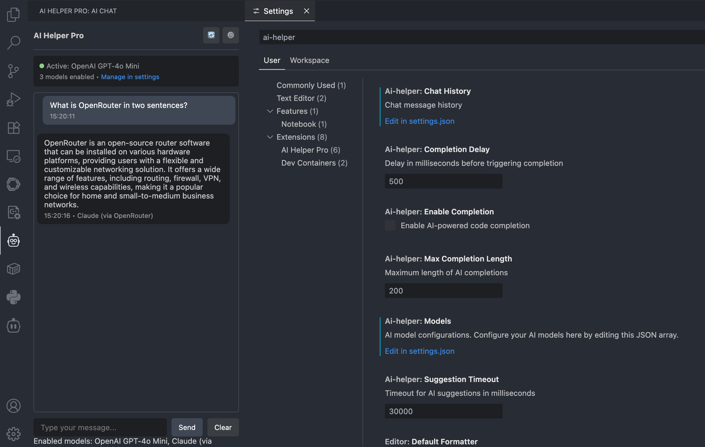
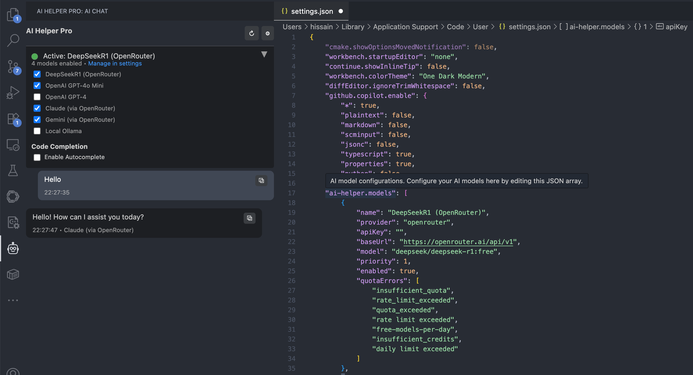

# AI Helper Pro

A comprehensive VSCode extension that provides AI-powered suggestions and code completion with support for multiple AI models, automatic fallback, and intelligent quota management.

## 🚀 Features





### Multi-Model AI Support

* **OpenAI GPT Models** (GPT-4, GPT-4o Mini, GPT-3.5)
* **Claude via OpenRouter** (Claude-3 Haiku, Sonnet, Opus)
* **Google Gemini via OpenRouter**
* **DeepSeek R1 via OpenRouter** (Free tier available)
* **Local Ollama Models**
* **Custom API Endpoints**

### Intelligent Fallback System

* Automatically switches to the next available model when quota is exhausted
* Configurable priority system for model selection
* Smart error detection for quota limits and rate limiting

### AI-Powered Code Completion

* Real-time code completion suggestions
* Context-aware completions based on surrounding code
* Toggle completion on/off as needed
* Configurable completion settings

### Interactive Chat Interface

* Built-in AI chat sidebar for continuous conversations
* Real-time model status indicators
* Chat history preservation
* Easy access to settings and model management

### Advanced Configuration

* Automatic default model initialization
* Multi-scope configuration support (User, Workspace, Folder)
* Set model priorities and enable/disable models
* Secure API key storage
* Custom quota error patterns
* Configurable timeouts and completion settings

## 🛠️ Installation

1. Install the extension from the VSCode Marketplace
2. The extension will automatically initialize with default models
3. Configure at least one AI model with API key
4. Start using AI suggestions, completions, and chat!

## ⚙️ Configuration

### Quick Setup

1. **Open AI Helper Pro** : Click the robot icon in the Activity Bar
2. **Configure Models** : Click the settings gear in the chat interface
3. **Edit Models Array** : Add your API keys to the existing models or add new ones
4. **Enable Models** : Set `"enabled": true` for models you want to use
5. **Save Settings** : The chat interface will update automatically

### Default Models

The extension comes pre-configured with these models (you just need to add API keys):

* **DeepSeek R1 (OpenRouter)** - Free tier available, enabled by default
* **OpenAI GPT-4o Mini** - Requires OpenAI API key
* **OpenAI GPT-4** - Requires OpenAI API key
* **Claude (via OpenRouter)** - Requires OpenRouter API key
* **Gemini (via OpenRouter)** - Requires OpenRouter API key
* **Local Ollama** - For local model hosting

### Supported Providers

#### OpenAI

* API Key: Get from [OpenAI Platform](https://platform.openai.com/api-keys)
* Models: `gpt-4`, `gpt-4o-mini`, `gpt-3.5-turbo`

#### OpenRouter (for Claude, Gemini, DeepSeek and more)

* API Key: Get from [OpenRouter](https://openrouter.ai/keys)
* Base URL: `https://openrouter.ai/api/v1`
* Models: `anthropic/claude-3-haiku`, `google/gemini-pro`, `deepseek/deepseek-r1:free`, etc.

#### Ollama (Local)

* Base URL: `http://localhost:11434/v1`
* Models: `llama2`, `codellama`, `mistral`, etc.
* Make sure Ollama is running locally

### Settings Configuration

Configure the extension through VSCode Settings (`Ctrl+,` or `Cmd+,`):

* **AI Helper: Enable Completion** - Enable/disable AI code completion
* **AI Helper: Completion Delay** - Delay before triggering completion (default: 500ms)
* **AI Helper: Max Completion Length** - Maximum completion length (default: 200 chars)
* **AI Helper: Suggestion Timeout** - Timeout for AI requests (default: 30s)
* **AI Helper: Models** - Main configuration array for all AI models

## 🎯 Usage

### AI Chat

1. **Open Chat** : Click the robot icon in the Activity Bar
2. **Start Chatting** : Type your message and press Enter
3. **View Model Status** : See which models are active and available
4. **Manage Models** : Click settings to configure models
5. **Clear Chat** : Use the Clear button to reset conversation

### AI Suggestions

1. **Select text** in your editor
2. **Right-click** and choose "AI Suggestion"
3. Or use  **keyboard shortcut** : `Ctrl+Shift+A` (Mac: `Cmd+Shift+A`)
4. View AI-generated suggestion in notification

### Code Completion

1. **Enable completion** : `Ctrl+Shift+Alt+A` (Mac: `Cmd+Shift+Alt+A`)
2. **Start typing** - completions appear automatically
3. **Accept completion** with `Tab` or `Enter`

### Model Management

* **View Status** : See all configured models and their status in chat interface
* **Refresh Models** : Click refresh button or use Command Palette
* **Edit Configuration** : Access through settings or chat interface
* **Toggle Completion** : Quick enable/disable for code completion

## 📋 Commands

| Command                 | Shortcut             | Description                            |
| ----------------------- | -------------------- | -------------------------------------- |
| AI Suggestion           | `Ctrl+Shift+A`     | Get AI suggestion for selected text    |
| Open AI Chat            | `Ctrl+Shift+Alt+C` | Open the AI chat interface             |
| Toggle AI Completion    | `Ctrl+Shift+Alt+A` | Enable/disable code completion         |
| Open AI Helper Settings | -                    | Open extension settings                |
| Add AI Model            | -                    | Quick access to model configuration    |
| Refresh AI Models       | -                    | Refresh model status and configuration |

## 🔄 Automatic Fallback

The extension intelligently handles quota exhaustion:

1. **Primary Model** tries first (lowest priority number)
2. **Quota Detected** - automatically switches to next model
3. **Continues** until successful or all models exhausted
4. **Error Types** detected: `insufficient_quota`, `rate_limit_exceeded`, `free-models-per-day`, etc.

## ⚠️ Configuration Scope Warning

 **Important** : VSCode has different configuration scopes (User, Workspace, Folder). Be aware of the following:

* If your **workspace** has an empty models array `[]`, it will override user/global settings
* If you see "No models configured" but have models in user settings, check if workspace settings are overriding them
* Use the **refresh models** command if configuration changes don't appear immediately
* The extension automatically detects and uses models from the most specific scope available

### Troubleshooting Configuration Issues

If models don't appear after configuration:

1. **Check Configuration Scope** : Open VS Code settings and verify which tab (User/Workspace) contains your models
2. **Use Refresh Command** : Run "AI Helper: Refresh AI Models" from Command Palette
3. **Check Console** : Open Developer Tools (Help → Toggle Developer Tools) to see configuration debugging info
4. **Clear Workspace Override** : If workspace has empty models array, either configure it there or remove the workspace setting

## 🎨 Example Configurations

### OpenAI Setup

```json
{
  "name": "OpenAI GPT-4o Mini",
  "provider": "openai",
  "model": "gpt-4o-mini",
  "apiKey": "sk-...",
  "baseUrl": "https://api.openai.com/v1",
  "priority": 1,
  "type": "chat"
  "enabled": true
}
```

### Claude via OpenRouter

```json
{
  "name": "Claude Haiku",
  "provider": "openrouter", 
  "model": "anthropic/claude-3-haiku",
  "apiKey": "sk-or-...",
  "baseUrl": "https://openrouter.ai/api/v1",
  "priority": 2,
  "type": "code"
  "enabled": true
}
```

### DeepSeek R1 (Free)

```json
{
  "name": "DeepSeekR1 (OpenRouter)",
  "provider": "openrouter",
  "model": "deepseek/deepseek-r1:free",
  "apiKey": "sk-or-...",
  "baseUrl": "https://openrouter.ai/api/v1",
  "priority": 1,
  "type": "both"
  "enabled": true
}
```

### Local Ollama

```json
{
  "name": "Local Llama2",
  "provider": "ollama",
  "model": "llama2",
  "apiKey": "dummy",
  "baseUrl": "http://localhost:11434/v1",
  "priority": 3,
  "enabled": true
}
```

## 🔒 Security

* API keys are stored securely in VSCode settings
* Keys are never logged or transmitted except to configured providers
* Sensitive configuration data is handled securely across all scopes

## 🛠 Troubleshooting

### No Models Available

* Check that at least one model is enabled with valid API key
* Verify configuration scope (User vs Workspace settings)
* Use "Refresh AI Models" command
* Check Developer Tools console for detailed error information

### Models Not Showing After Configuration

* **Configuration Scope Issue** : Check if workspace settings override user settings
* **Refresh Required** : Use the refresh button in chat interface
* **Empty Workspace Override** : Remove empty models array from workspace settings
* **Settings Propagation** : Wait a moment and try refresh command

### Completions Not Working

* Toggle completion on with `Ctrl+Shift+Alt+A`
* Check completion delay settings
* Verify model has sufficient quota and valid API key
* Ensure at least one model is enabled

### API Errors

* Verify API keys are correct and have sufficient credits
* Check base URLs for custom providers (OpenRouter, Ollama)
* Review quota error patterns in model configuration
* Check network connectivity for API endpoints

### Chat Interface Issues

* Click refresh button to reload models
* Check settings configuration through the gear icon
* Verify models are enabled with valid API keys
* Use Developer Tools to check for JavaScript errors

## 📝 Release Notes

### 2.0.7

* Fixed duplicate line issue in code autocompletion (no more repeated lines)
* Debounced and context-aware code completion (avoids suggestions in comments/strings)
* Modularized codebase for better maintainability
* Improved model fallback: automatically tries next enabled model on quota/error
* Enhanced chat UI: better model management, notifications, and copy-to-clipboard
* Settings sync: toggle code completion and manage models directly from chat sidebar
* Performance improvements and bug fixes

### 2.0.6

* Enhanced chat window with expandable model status setting
* Autocompletion possible from chat window
* Code autocompletion is refined with file context

### 2.0.5

* Enhanced README.md

### 2.0.4

* Enhanced configuration scope handling (User, Workspace, Folder)
* Improved default model initialization
* Better configuration debugging and error reporting
* Fixed model refresh and settings synchronization issues
* Added comprehensive configuration scope warnings

### 2.0.3

* Interactive AI chat interface with sidebar
* Real-time model status indicators
* Chat history preservation
* Improved model management and refresh capabilities
* Enhanced error handling and user feedback

### 1.0.0

* Multi-model AI support with 5+ providers
* Automatic fallback system
* AI-powered code completion
* Advanced model management
* Configurable priorities and settings
* Secure API key storage

## 🤝 Contributing

Found a bug or have a feature request? Please open an issue on our [GitHub repository](https://github.com/hissain/NoQuota).

## 📄 License

This extension is licensed under the MIT License.

---

**Enjoy coding with AI assistance! 🚀**
